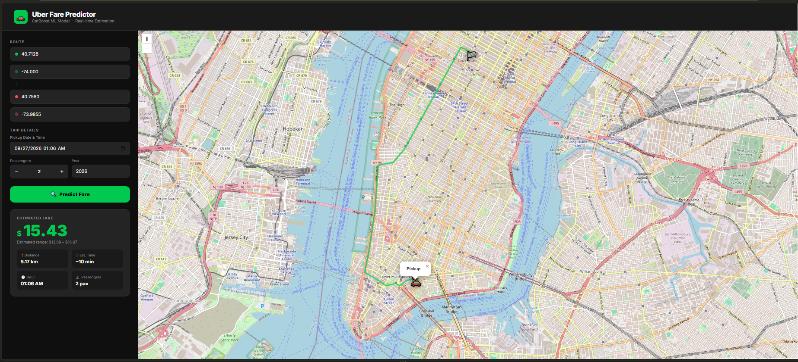

# Ride Fare Estimation

Ride Fare Estimation is a Machine Learning project that predicts the estimated fare of a ride.

The project uses different Machine Learning regression models and selects a final model for fare prediction.

A Flask web application is also created to make predictions through a simple user interface.

## Project Features

- Ride fare prediction
- Pickup and drop-off location input
- Passenger count input
- Date and time input
- Distance calculation
- Estimated trip time
- Estimated fare range
- Interactive map
- Machine Learning based prediction
- Flask web application

## Dataset

The dataset contains ride information and fare values.

The main features include:

- Pickup latitude
- Pickup longitude
- Drop-off latitude
- Drop-off longitude
- Passenger count
- Pickup date and time
- Fare amount

## Data Processing

The following steps were used in the project:

1. Load the dataset
2. Check the dataset shape
3. Check the columns
4. Check missing values
5. Check duplicate values
6. Process the date and time
7. Create new time-based features
8. Select the input features
9. Split the data into training and testing sets

The following time features were created:

- Hour
- Day
- Month
- Year
- Day of Week

## Machine Learning Models

Several regression models were tested:

- Decision Tree
- Random Forest
- AdaBoost
- Extra Trees
- Gradient Boosting
- XGBoost
- CatBoost

The models were compared using:

- MSE
- RMSE
- MAE
- R2 Score

## Model Performance

The final CatBoost model achieved:

| Metric | Score |
|---|---:|
| Test R2 | 72.01% |
| Test RMSE | 5.46 |
| Test MAE | 2.04 |
| Test MSE | 29.76 |

CatBoost was selected as the final model used in the application.

## Final Model

The trained model is saved as:

```text
final_model_cat.pkl



